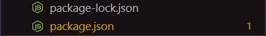
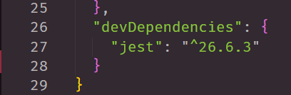

# nodeGroceries
- - -
## About

This repository consist of constructors and running test for our constructors. This application is a server-side application that is meant for grocery list purposes. 

## Server-Side Code Guide

```
    - Main Focus:       File Structure
    - Primary Focus:    Lib Folder
    - Secondary Focus:  Tests Folder
    - Brief Focus:      app.js
```

> lib Folder

In the lib folder short for library folder, consist of all your constructors. 

***Example Product.js***


After all constructors are successfully tested proceed to make a render.js file.
In this js file we use the writeFile method.

***Example render.js***


> node_modules

In this node-Modules Folder we bring in npm packages, and Jest as a "dev-Dependencies".
Once you have ran all the command your node modules and and package.json will load.

```
Terminal Commands:
    - npm i || npm init -y
    - npm install --save-dev jest
```

***Example node_modules***


***Example package.json***





> output Folder

The developer needs this section because this is were we will render our HTML.

> templates Folder

In this section we create templates in a HTML doc letting it render HTML to the user.

```
    - main.html: will replace all content in main.html
    - food.html: place holder for food info
    - beverage.html: place holder for beverage info
    - product.html: place holder for product info
```

> tests Folder

In this section we create test to make sure that all of our constructors are working correctly.
We use Jest to help us test all of our function and make sure they "pass" prior to launch.

> app.js


## Resource Reference 

- [JEST](https://jestjs.io/docs/en/getting-started)
- [NPM](https://www.npmjs.com/package/npm)
- [Inquirer](https://www.npmjs.com/package/inquirer/v/5.2.0)

## LINKS

➼ Server-Side Based Repo
- [GitHub Repo Link](https://github.com/nicholasd-uci/nodeGroceries)
- [Nicholas Dallas's GitHub](https://github.com/nicholasd-uci)

- - -
© 2020 NPRD, Nicholas Paul Ruiz Dallas