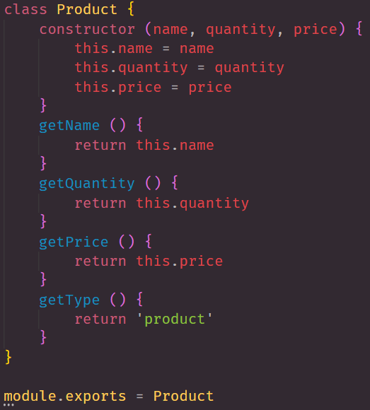
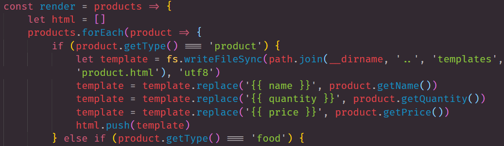

# nodeGroceries
- - -
## About

This repository consist of constructors and running test for our constructors. This application is a server-side application that is meant for grocery list purposes. 

## Server-Side Code Guide

```
    - Main Focus:       File Structure
    - Primary Focus:    Lib Folder
    - Secondary Focus:  Tests Folder
    - Brief Focus:      app.js
```

> lib Folder

In the lib folder short for library folder, consist of all your constructors. 

***Example Product.js***


After all constructors are successfully tested proceed to make a render.js file 

*** Example render.js***


> node_modules

> output Folder

> templates Folder

> tests Folder

> app.js


## LINKS

- [GitHub Repo Link](https://github.com/nicholasd-uci/nodeGroceries)
- [Nicholas Dallas's GitHub](https://github.com/nicholasd-uci)

- - -
© 2020 NPRD, Nicholas Paul Ruiz Dallas